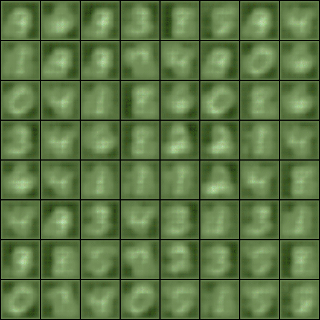
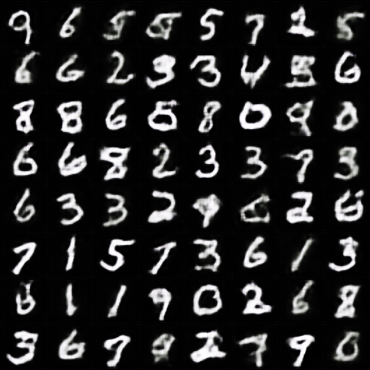
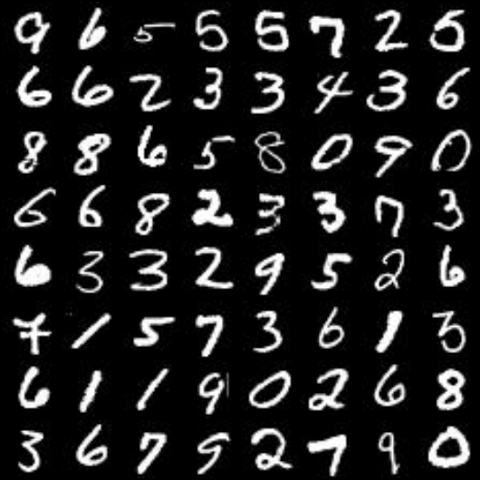

## Notes

Pytorch implementation of `conditional gan` with `wgan-gp`. Tested so far only on mnist. Trained with a very small subset of mnist. Results are decent on mnist after `30 epochs`. 

Training can be monitored on tensorboard. Instruction can be found on `wgan-gp` implementation readme.

## Results

## Todo

- [ ] Test to see if works on other datasets.

## References

- Conditional Generative Adversarial Nets, https://arxiv.org/abs/1411.1784
