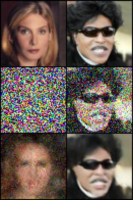

# DDIM

**Newest version available here, https://github.com/quickgrid/pytorch-diffusion.**

Implementation of DDIM (Denoising Diffusion Implicit Model). Training noise steps `T` can be large like `T = 1000`. Compared to DDPM, DDIM can generate good samples fast in less number of steps. For example, DDIM can generate quality sample in 20 to 50 steps where DDPM may need 500 or more steps based on training noise steps.

### Results

Results were upsampled from `64 x 64` trained model output to `128 x 128` by nearest interpolation.

Ground Truth Image vs. Random Noised Image vs. Denoised Image.

### Codes

| Name | Description |
| ----------- | ----------- |
| ddim.py | DDIM implementation with training, sampling image, gif. |

### Pretrained Checkpoints

Models are available in, https://huggingface.co/quickgrid/pytorch-diffusion.

## Process

TODO

## Issues

- Logging does not print in kaggle.

## References
- https://github.com/quickgrid/paper-implementations/tree/main/pytorch/ddpm
- https://keras.io/examples/generative/ddim/
- https://openreview.net/pdf?id=St1giarCHLP
