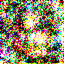
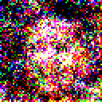
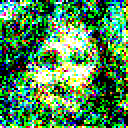
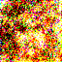

# DDIM

**Newest version available here, https://github.com/quickgrid/pytorch-diffusion.**

Annotated implementation of DDIM (Denoising Diffusion Implicit Model). 

### Results

Results were upsampled from `64 x 64` trained model output to `128 x 128` by nearest interpolation.

### Codes

| Name | Description |
| ----------- | ----------- |
|  |  |

### Pretrained Checkpoints

Models are available in, https://huggingface.co/quickgrid/pytorch-diffusion.

| Dataset | Download Link |
| ----------- | ----------- |
|  |  |

## Process

TODO

## Issues

- Logging does not print in kaggle.

## References
- TODO
