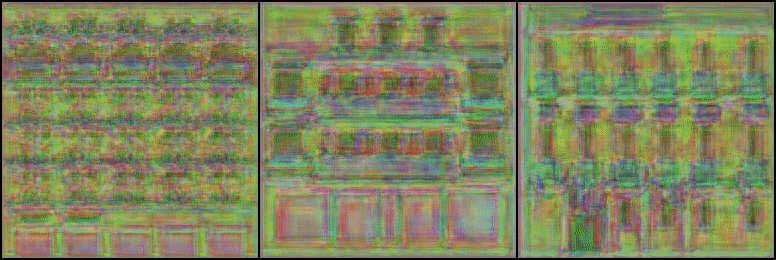

## Notes

Tested on [Facade dataset](https://cmp.felk.cvut.cz/~tylecr1/facade/). Training seem to converge even on dataset of 1000 pictures. `SPADE` block previous input tensor needs to be normalized then modulated with `beta`, `gamma` embedding output of segmentation mask.

Textures seem to be missing on 10 epochs tested.

## Results

## Todo

- Improve generation result quality.
- Use multiscale discriminator outputs in loss calculation.
- ~~Fix KL loss becomes nan.~~
- ~~Fix training not converging.~~
- ~~Fix after some iterations combined generator, vgg, feature loss becomes nan.~~
- ~~Discriminator backward fails due to nan.~~
- Pass device type through function.
- Modify to try to generate and match mask also as loss.

## References

- https://arxiv.org/abs/1903.07291
- https://keras.io/examples/generative/gaugan/
- https://github.com/quickgrid/AI-Resources/blob/master/resources/ai-notes/gaugan-series.md
