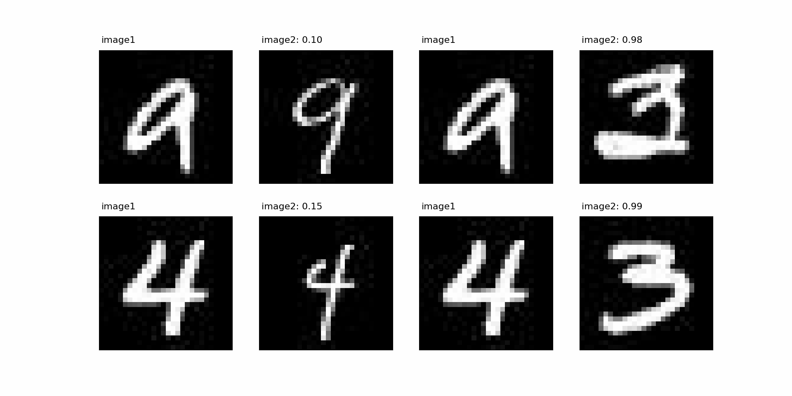

## Notes

Implementation of siamese network with contrastive loss. Only tested on mnist though it should work on other datasets. 

Training converged quickly when parameters were not frozen. Loss comes down steadly and make flucture somewhat then again come down.

This is an extension of [siamese network with triplet loss](https://github.com/quickgrid/paper-implementations/blob/main/pytorch/siamese-triplet-loss) training and inference. 

For MNIST following dataset was used, https://www.kaggle.com/scolianni/mnistasjpg.

## Results

## TODO

- [ ] Test implementation on other types of dataset. 

## References

- [Siamese Neural Networks for One-shot Image Recognition](https://www.cs.cmu.edu/~rsalakhu/papers/oneshot1.pdf)
- [Dimensionality Reduction by Learning an Invariant Mapping](http://yann.lecun.com/exdb/publis/pdf/hadsell-chopra-lecun-06.pdf)
