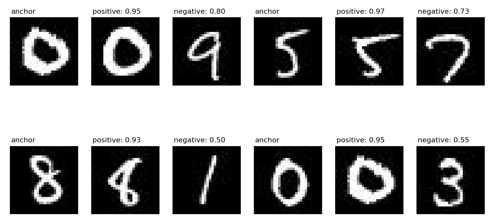

## Notes

Implementation of siamese network with triplet loss from, [FaceNet: A Unified Embedding for Face Recognition and Clustering](https://arxiv.org/pdf/1503.03832.pdf), paper.

Current implementation is tested on `MNIST`. `ResNet18` is backbone for transfer learning with training with extracted intermediate layers and layers not frozen. A few linear layers are added with resnet 18 to generate embeddings.

Few epochs should be enough to get a good enough result on MNIST dataset.

This is an extension of [siamese network implementation](https://github.com/quickgrid/code-lab/blob/master/code-lab/pytorch/pytorch_siamese_network.py) I tried to implement. 

For MNIST following dataset was used, https://www.kaggle.com/scolianni/mnistasjpg.

## Results

## TODO

- [ ] Test implementation on other types of dataset. 

## References

- [FaceNet: A Unified Embedding for Face Recognition and Clustering](https://arxiv.org/pdf/1503.03832.pdf)
