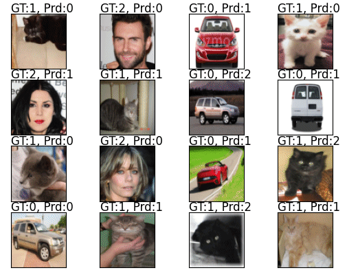

## Notes

Trained on small subset of `MNIST` greyscale images. Also trained on `6000` images of `person, cat, car` with `2000` images each. Tested with `image_size=32, patch_size=8` and `image_size=72, patch_size=6`.

By providing `checkpoint_path` it will resume training from last point. Seems to produce acceptable result within a few epochs without pretraining.

### Data Format

In sample gif below, `true` labels for the classes are `[car, cat, person] = [0, 1, 2]`. Directory structure for running code should be,

```
dataset_path
  class_1
    img1.jpg
    img2.jpg
    ...
  class_2
    img1.jpg
    img2.jpg
    ...
  class_3
    img1.jpg
    img2.jpg
    ...
  ...
```

### Monitoring Progress

Assuming tensorboard is installed with tensorflow or separately. Monitoring progress in tensorboard in windows,

```
tensorboard --logdir=C:\GAN\logs --host localhost --port 8088
```

In browser head to, http://localhost:8088/ to see tensorboard. Replace, `C:\GAN\logs` with the location of this code where `logs` folder is generated.


## Results



## Todo

- Add class token to patch embedding.
- Check if implementation is correct.


## References
- https://arxiv.org/abs/2010.11929
- https://keras.io/examples/vision/image_classification_with_vision_transformer/
- https://github.com/lucidrains/vit-pytorch/blob/main/vit_pytorch/vit.py
- https://github.com/jeonsworld/ViT-pytorch/blob/main/models/modeling.py

## Acknowledgement

Thanks to Lucas N. for finding implementation mistakes in a previous commit, alternative approaches as well as quite a few pytorch best practices suggestion.
